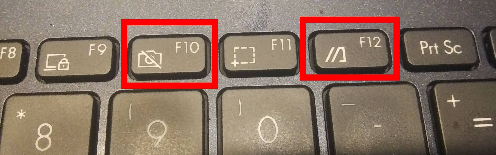

<!----------------------------------------------------------------------------->
<!-- Filename: README.md                                       /          \  -->
<!-- Project : Asus_L410M_WMI_Keys                            |     ()     | -->
<!-- Date    : 02/17/2019                                     |            | -->
<!-- Author  : Dana Hynes                                     |   \____/   | -->
<!-- License : WTFPLv2                                         \          /  -->
<!----------------------------------------------------------------------------->

# Asus_L410M_WMI_Keys
## "It mostly works™"

This small program runs at boot and gives you access to the keys on the keyboard that aren't handled by the current asus-nb-wmi driver.

On my laptop (a 2021 Asus L410M) these are the camera toggle key (same as F10) and the "Launch MyAsus" or "//]" key (same as F12).



# Installing

To install, clone the git repo:
```bash
foo@bar:~$ cd ~/Downloads
foo@bar:~/Downloads$ git clone https://github.com/danahynes/Asus_L410M_WMI_Keys
foo@bar:~/Downloads$ cd Asus_L410M_WMI_Keys
```

Next you need to install the python libevdev library:
```bash
foo@bar~/Downloads/Asus_L410M_WMI_Keys$ pip3 install libevdev
```

You MAY need to find the key scancodes and edit asus_l410m_wmi_keys.py before you install.

**See note below!**

Once you do that, you can install by:
```bash
foo@bar:~/Downloads/Asus_L410M_WMI_Keys$ sudo ./install.sh
```
You can also download the [latest release](http://github.com/danahynes/Asus_L410M_WMI_Keys/releases/latest), unzip it, possibly set the scancodes in asus_l410m_wmi_keys.py, and run the install.sh file as sudo from there.

# Uninstalling

To uninstall, go to the git directory and run:
```bash
foo@bar:~/Downloads/Asus_L410M_WMI_Keys$ sudo ./uninstall.sh
```

or delete the files manually:
```bash
foo@bar:~$ sudo rm -rf /usr/bin/asus_l410m_wmi_keys.py
foo@bar:~$ sudo rm -rf /lib/systemd/system/asus_l410m_wmi_keys.service
foo@bar:~$ sudo rm -rf /var/log//asus_l410m_wmi_keys.log
```

# Finding the KEY_WMI_* values

Here's how to find the KEY_WMI_* values for the keys you want to map:

Press the key you want to map a few times, then do this:
```bash
foo@bar~$ dmesg
```
where the you should find this near the end of the output:
```bash
[30999.432449] asus_wmi: Unknown key 85 pressed
[31001.608410] asus_wmi: Unknown key 85 pressed
[31001.608410] asus_wmi: Unknown key 85 pressed
```

In this case scancode 85 is my camera key. Note that this is a hex value so it must be written as 0x85.

Use these values in asus_l410m_wmi_keys.py to fire events for your unused keys. Also if you have other keys that don't work, and you know python, you can map more keys to more functions if you have other non-working keys.

# Notes

I banged my head against a wall for a few hours until I found a solution to this. At first I thought the asus-nb-wmi driver was swallowing events for keys it did not recognize (actually some programs, like *xev*, could see them being pressed and released but they just had 0x0 scancodes). But then I realized the asus-nb-wmi driver was logging them in *dmesg* as "unknown" keys, but with unique scancodes. Turns out that the python library libevdev can read the scancodes from the keyboard before the asus-nb-wmi driver throws them away!

<!--
For the camera key, I am "poking" a value into a file that the camera watches to see if it should be enabled.

Those of you who have them at the ready, please put on your tinfoil hats.

This is NOT a one-to-one hardware switch for the webcam. It will turn the webcam off if you're using an app that is using the webcam, but it won't turn back on if the app is still running. Also if you use the key while the camera is in use, there is an issue where the system file gets out of sync (I believe the app has a lock on the file) and you may have to press the button a few times with all apps closed to re-sync it. Also, there is no indicator for whether the cam is currently on or off, other that the green LED if you have a cam app open. I'm working on these issues, but for now, "it mostly works™".

Also note that if no camera is found, or if more than one camera is found, the camera key will be remapped to Shift-Meta-R.
-->

Turning the camera on and off is still a work in progress, so for now the camera key is mapped to Shift-Meta-R. As for the "MyAsus" key, it presents itself as Shift-Meta-T. The screenshot (F11) key is already mapped to Shift-Meta-S, so these seemed like reasonable values for the keys to the left and right of it.

If the WMI keyboard can't be found, then all hope is lost and the programs quits.

Note that the keys are also function keys, so what happens when you press them depends on the state of the Fn key. This laptop, and others like it, have a "Function Lock" feature (similar to Caps Lock) that is activated by pressing Fn+Esc. This feature is set to "on" at boot, so you may need to turn it off or press Fn along with the key to get the desired behavior. The "Function Lock" feature can be turned of in the BIOS menu, in which case you need to press the "Fn" key with the desired key to use the WMI function (volume, screen brightness, etc.)

# TODO

1. camera file lock checking/syncing
1. camera enabled indicator (not the same as the in-use light)

# -)
